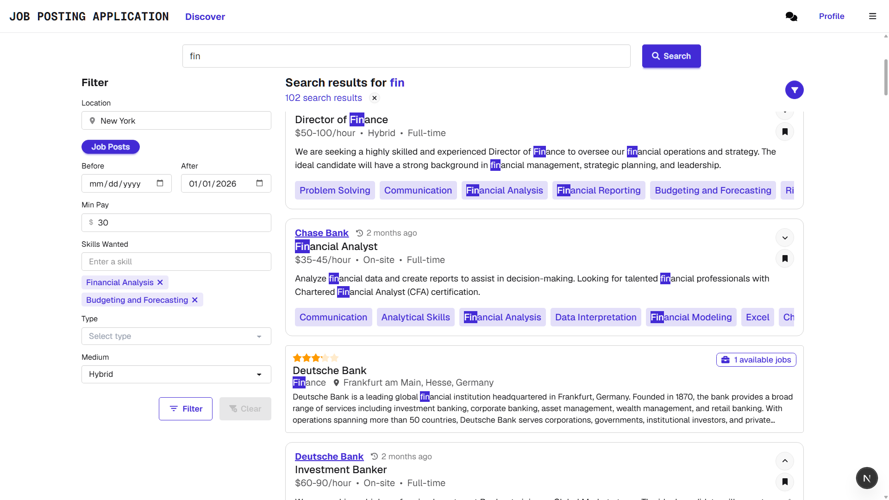
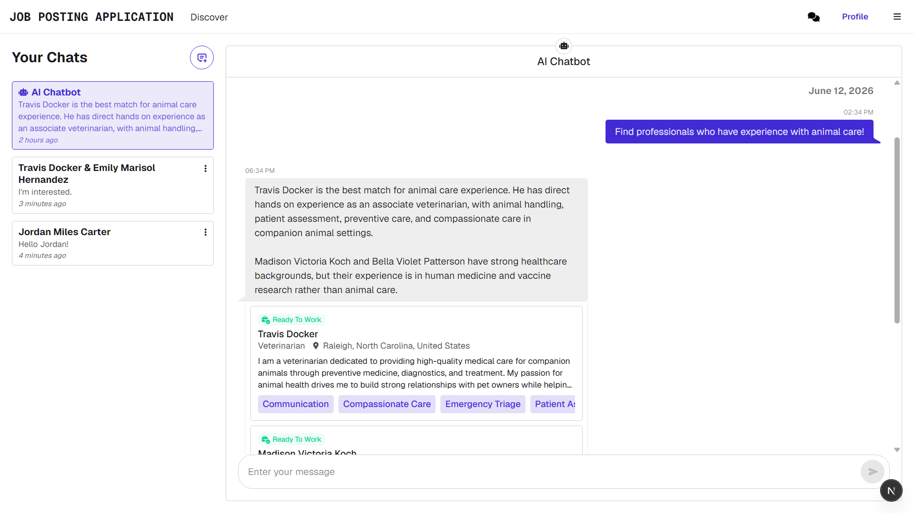

# Job Posting Application
This project is a full-stack AI-powered job platform built with Next.js, ASP.NET Core, and PostgreSQL. It also relies on DaisyUI and TailwindCSS for the user interface, and OpenAI to power semantic search, personalized discovery, and an AI career assistant. Users can browse and search for employers, job posts, and job seekers, build their profiles and resumes to attract employers, save and apply to positions, post reviews, and communicate through direct messages or with an AI chatbot.




## Prerequisites
- .NET 9.
- PostgreSQL 16+.
- Node Package Manager (NPM).
- Valid OpenAI API key.
- Valid secret key for JWT authentication. Generate one at this [website](https://jwtsecretkeygenerator.com).
- SMTP provider, preferably Mailtrap. 
  - Note that to send real emails with services like Mailtrap, a verified domain will need to be provided. Otherwise,  just use the sandbox SMTP that limits recipients to a single testing email address. 
  - Gmail is also a valid option. Refer to this [guide](https://serversmtp.com/smtp-gmail-configuration) for setup.

## Setup
Clone this repository.

### Backend
1. Enter the directory `backend` and open the .NET solution in an IDE/code editor compatible with .NET (Visual Studio, VS Code, Rider, etc.)
2. Open appsettings.json and replace all the placeholders with your Postgres credentials, JWT secret key, OpenAI API key, and SMTP service credentials.
3. Open a terminal and change directory to `backend/Backend`. Run the command ```dotnet ef database update```. This command will run the initial migration that creates and seeds the application's database.

### Frontend

1. Open a terminal and change directory to `frontend`.
2. Run ```npm install``` to install the necessary dependencies.

## Running and Deploying

### Development
1. Debug or run the .NET backend project. The command for running the project (without debugging) is ```dotnet run```.
2. In the Next.js frontend, run ```npm run dev``` to start the frontend's development server.

### Production
1. Publish the .NET project. The command for publishing is ```dotnet publish```.
2. Go into the directory where the project was published (it should be `bin\Release\net9.0\publish` usually) and run the executable to start the production server.
3. Back in the Next.js frontend, build the optimized production version of the app by running ```npm run build```.
4. Run ```npm start``` to launch the production version of the app.